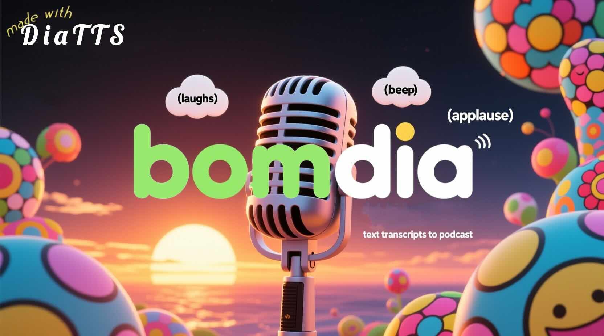

# Bom Dia - Podcast Generator

Bom Dia is a tool that converts text transcripts into podcast-style audio files with verbal tags (like laughter, sighs, etc.) added for a more natural listening experience.

## Features

- Converts text transcripts to audio podcasts
- Automatically adds verbal tags for a more natural conversation flow
- Uses AI models for intelligent tag placement
- Employs an agentic workflow with Director and Actor agents for sophisticated tag injection
- Provider-agnostic LLM support through LiteLLM (OpenAI, Ollama, Anthropic, Google Gemini, etc.)
- Automatic synthetic voice prompt generation for improved speaker consistency

## Installation

At this time installation is not beginner friendly. see [DIA_CHANGES.md](DIA_CHANGES.md) for prerequisite changes to Dia TTS to get started.

```bash
# Clone the repository
git clone <repository-url>
cd bomdia

# Install dependencies
pip install -e .
```

## Usage

```bash
bomdia input_transcript.txt output_podcast.mp3
```

### Voice Cloning Options

The application supports different voice generation modes for each voice, including:

-  **High-Fidelity Cloning**: Provide both an audio prompt and its matching transcript for the most accurate voice cloning
-  **Synthetic Voice Prompts**: Automatically generate voice prompts for speakers without provided audio using AI-generated speech
-  **Consistent Pure TTS**: No voice prompt provided, system generates a consistent voice automatically

```bash
# High-Fidelity Cloning (requires both --sX-voice and --sX-transcript)
bomdia --s1-voice speaker1.wav --s1-transcript "This is what speaker 1 sounds like" input_transcript.txt output_podcast.mp3

# Consistent Pure TTS (no voice prompts, system generates consistent voices)
bomdia input_transcript.txt output_podcast.mp3
```

The input audio should be in WAV format. See the Dia TTS project for recommendations on best practices regarding audio (length and transcript).

> **Recommendations for Voice Prompt Audio:**
>
> For the best voice cloning results, the total duration of all provided audio prompts should be between **5 to 10 seconds**. If you are providing prompts for multiple speakers, ensure each speaker has at least 3-5 seconds of clear audio. The model learns the voice characteristics from this audio, so high-quality, clean recordings are essential.

Although not documented, and a clear recommendation is made to use transcripts in the official DiaTTS project, it is technically possible to generate voice cloning without the correspodning transcript:

```bash
# Voice Prompt Cloning (only --sX-voice)
bomdia --s1-voice speaker1.wav --s2-voice speaker2.wav input_transcript.txt output_podcast.mp3
```

### Seeding for Voice Consistency

When using Consistent Pure TTS mode for speakers in multi-block transcripts, a seed is mandatory for voice consistency.

```bash
# Provide your own seed for reproducible results
bomdia --seed 12345 input_transcript.txt output_podcast.mp3
```

If not provided, the application will generate a secure random seed and log it for reproducibility.

### Synthetic Voice Prompt Generation

When speakers in your transcript don't have provided voice prompts, Bom Dia can automatically generate synthetic voice prompts to improve voice consistency across the generated podcast. This feature creates short audio samples for each unprompted speaker using AI-generated speech.

#### Configuration

Synthetic voice prompt generation can be controlled through the configuration file `config/app.toml`:

```toml
[pipeline]
# Enable or disable synthetic voice prompt generation
generate_synthetic_voice_prompts = true  # default: true
```

#### How It Works

1. **Detection**: The system identifies speakers without provided voice prompts
2. **Generation**: Creates a short synthetic audio sample using predefined text content
3. **Integration**: Uses these synthetic prompts during the main audio generation process
4. **Consistency**: Ensures all speakers have voice references for better consistency

#### Standalone Worker Script

Bom Dia includes a standalone worker script for generating synthetic voice prompts:

```bash
# Generate a synthetic voice prompt for speaker S1 with a specific seed
generate-prompt --speaker-id S1 --seed 12345 --output-dir ./prompts/

# Generate with a random seed (printed to stderr)
generate-prompt --speaker-id S2 --output-dir ./prompts/
```

The worker script outputs JSON metadata to stdout and saves audio/transcript files to the specified directory.

#### Benefits

- **Improved Consistency**: Provides voice references for all speakers
- **Automatic Workflow**: Seamlessly integrates into the main pipeline
- **Reproducible Results**: Uses seeded generation for consistent output
- **Flexible Configuration**: Can be disabled if not needed

### Verbosity Control

The application provides two flags for controlling output verbosity:

- `-v`, `--verbose`: Sets logging level to INFO, showing standard process flow
- `--verbosity {DEBUG,INFO,WARNING,ERROR}`: Sets a specific logging level

Additional workflow control flags:

- `--dry-run`: Execute the entire agentic rehearsal process and print the final transcript without generating any audio files
- `--no-rehearsals`: Bypass the Director/Actor workflow and send the parsed transcript directly to audio generation (requires a clean, pre-formatted transcript)

Examples:
```bash
# Show standard process flow
bomdia -v input_transcript.txt output_podcast.mp3

# Show detailed debugging information
bomdia --verbosity DEBUG input_transcript.txt output_podcast.mp3

# Execute rehearsal process and print final transcript without generating audio
bomdia --dry-run input_transcript.txt output_podcast.mp3

# Skip rehearsals and generate audio directly from parsed transcript
bomdia --no-rehearsals input_transcript.txt output_podcast.mp3

# Show only errors and warnings (default)
bomdia input_transcript.txt output_podcast.mp3
```

## Configuration

For more details, see the full [Configuration Guide](CONFIGURATION.md).

### LLM Configuration

This project uses LiteLLM to support various LLM providers. Configure your model and parameters in `config/app.toml`:

```toml
[model]
# LiteLLM model string. Examples:
# "openai/gpt-4o-mini"
# "ollama/llama3"
# "mistral/mistral-large-latest"
# "openrouter/openai/gpt-4o-mini"
llm_spec = "openai/gpt-4o-mini"

[model.parameters]
# Optional parameters to pass to the model
temperature = 0.5
max_tokens = 150
```

**Environment Variables:**
You must also set the appropriate environment variables for your chosen provider.

-   For **OpenAI**, set `OPENAI_API_KEY`.
-   For **Mistral AI**, set `MISTRAL_API_KEY`.
-   For **OpenRouter**, set `OPENROUTER_API_KEY`.
-   For **Ollama** or other **OpenAI-Compatible Endpoints**, ensure the local server is running. You may need to set `OPENAI_API_BASE` or `OLLAMA_API_BASE` if it's not at the default address.

### Other Configuration

Other configuration options can be found in `config/app.toml`, including:
- Model checkpoints for the TTS system
- Pipeline behavior parameters
- Verbal tags and line combiners
- Device selection for TTS model (advanced users)

Detailed information about the agentic workflow configuration can be found in `config/prompts.toml`.

## Development

### Running Tests

```bash
pytest
```

The tests use in-memory SQLite databases to prevent polluting the repository with database files. When running tests, the `REHEARSAL_CHECKPOINT_PATH` configuration is automatically set to `:memory:` to use in-memory databases.

### Code Quality

```bash
# Format code
black src/ shared/ main.py

# Lint code
ruff check  src/ shared/ tests/ main.py

# Type check
mypy shared/ src/ main.py

# Security sanity check
bandit -c pyproject.toml -r src/ shared/ tests/ main.py
```

## Components

For detailed information about specific components, see the [components documentation](docs/components/).

## Versioning and Changelog

See [CHANGELOG.md](CHANGELOG.md) for information about releases related to version numbers. The [pyproject.toml](pyproject.toml) is the authoritative source for the current version number.

## License

This project is released under the Apache 2.0 license (see [License](LICENSE)). This is was chosen because of a commitment to OSS, and it is the same license as Dia TTS uses that the project relies on (at the time of writing).
